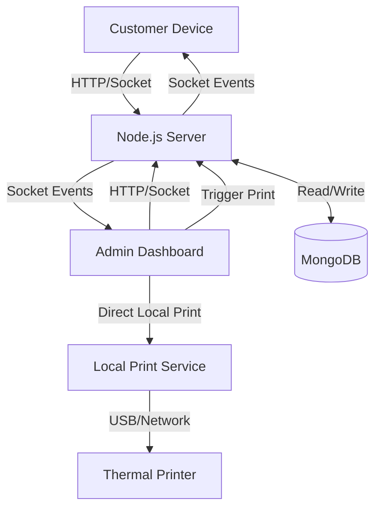

# 🍽️ Aatreyo Restaurant (Zink Zaika)

A modern, full-stack restaurant management system featuring real-time ordering, a powerful admin dashboard, and an integrated local print service for automated KOT (Kitchen Order Ticket) printing.


## 🌟 client url
https://atr-resturant.vercel.app/
## 🌟 admin url
https://atr-resturant-admin.vercel.app/
### 📱 Customer App (Client)
- **Mobile-First Design**: Optimized for seamless ordering on any device.
- **Real-Time Data**: Live menu availability and order status updates via Socket.IO.
- **Smart Cart**: interactive cart with upsell suggestions and detailed bill summary.
- **Order Tracking**: Live countdown and status tracking (Pending → Preparing → Ready).
- **Floating Cart**: Quick access to checkout from anywhere on the menu.

### ⚡ Admin Dashboard
- **Live Order Feed**: Instant notifications for incoming orders.
- **Session Management**: Group orders by customer session for efficient tracking.
- **Menu Management**: Add, edit, and delete items with image support.
- **Bill Generation**: Generate PDF bills and share via WhatsApp.
- **Analytics**: Visual insights into sales and order trends.

### 🖨️ Print Service (New!)
- **Automated KOT Printing**: Automatically prints orders to the kitchen printer upon acceptance.
- **Silent Printing**: Runs in the background on the local machine.
- **Mock Mode**: Supports testing without physical hardware.

---

## 🏗️ System Architecture



## 🛠️ Tech Stack

- **Frontend**: React.js, Vite, Tailwind CSS, Lucide Icons, Framer Motion
- **Backend**: Node.js, Express.js, Socket.IO
- **Database**: MongoDB (Mongoose ODM)
- **Real-Time**: Socket.IO (Bidirectional communication)
- **Printing**: Node-thermal-printer, local express server

---

## 🚀 Getting Started

Follow these steps to set up the entire system locally.

### 1. Prerequisites
- **Node.js** (v16 or higher)
- **MongoDB** (Local or Atlas URI)
- **Git**

### 2. Installation

#### 🖥️ Backend (Server)
The heart of the application.
```bash
cd server
npm install
# Configure .env (see Configuration section)
npm start
# Runs on Port 5000
```

#### 👑 Admin Dashboard
The control center for restaurant staff.
```bash
cd AdminDashbord
npm install
npm run dev
# Runs on Port 5174
```

#### 📱 Client App
The customer-facing ordering interface.
```bash
cd client
npm install
npm run dev
# Runs on Port 5173
```

#### 🖨️ Print Service (Optional)
Run this on the machine connected to the thermal printer.
```bash
cd print-service
npm install
npm start
# Runs on Port 6000
```

---

## ⚙️ Configuration

Create a `.env` file in the `server` directory with the following variables:

```env
# Server Configuration
PORT=5000
MONGO_URI=mongodb://localhost:27017/aatreyo_db
# OR your MongoDB Atlas URI

# CORS Configuration (Allowed Origins)
CLIENT_URL=http://localhost:5173
ADMIN_URL=http://localhost:5174

# Security
JWT_SECRET=your_super_secret_jwt_key
ADMIN_SECRET_CODE=12345
```

For the **Client** and **Admin** apps, ensure `src/config.js` or `.env` points to the correct backend URL (default `http://localhost:5000`).

---

## 🐛 Troubleshooting

### Common Issues

**1. Port 6000 is occupied (Print Service Error)**
- **Error**: `EADDRINUSE: address already in use :::6000`
- **Fix**: Port 6000 is often reserved by browsers (like Chrome) as unsafe. 
    - *Solution*: Change the port in `print-service/index.js` to `6001` or another safe port, and update the Admin Dashboard configuration to match.
    - *Windows Fix*: Run `net stop "Print Spooler"` (only if conflict is with spooler, unlikely) or identify the process using `netstat -ano | findstr :6000` and kill it.

**2. Images not loading**
- Ensure images are placed in the `public` folder or hosted correctly.
- Check `server.js` static file serving configuration if images are uploaded to the backend.

**3. Real-time updates not working**
- Verify `Socket.IO` connection in the browser console.
- Ensure Server, Client, and Admin are allowed in CORS settings.

---

## 📄 License
This project is proprietary software. All rights reserved.
